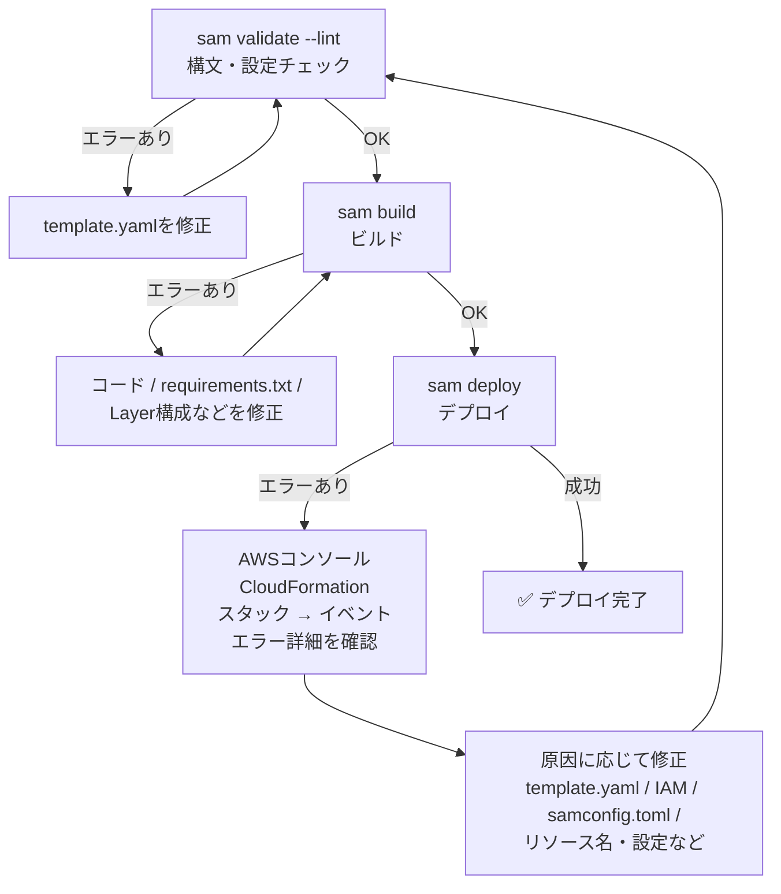

# AWS SAM コマンド & トラブルシューティング（7～10章）

---

> **関連ドキュメント**：[← 入門ガイド（0～2章）](./SAM_入門ガイド.md) | [テンプレートリファレンス（3～6章）](./SAM_テンプレート_リファレンス.md)

---

## 7. samconfig.toml の詳細

`samconfig.toml` は、`sam deploy` などのSAM CLIコマンドで使用するデフォルト設定ファイルです。

毎回コマンドラインで長いオプションを入力しなくても、環境ごとの設定をファイルに保存して再利用できます。

この教材では、物理リソース名の基本形を `${ResourcePrefix}-${Environment}-${ProjectName}` とします。

```text
ResourcePrefix = as
Environment    = dev / prd
ProjectName    = sam-project
```

```toml
# ファイル形式のバージョン（固定）
version = 0.1

# -------------------------
# 開発環境の設定
# -------------------------

[dev]
[dev.deploy]
[dev.deploy.parameters]

# CloudFormationスタック名
# AWSコンソールのCloudFormationに表示される名前
stack_name = "as-dev-sam-project"

# S3バケット内の保存先プレフィックス
# sam deploy 時にLambdaなどのデプロイ用アーティファクトを
# S3へアップロードする際のパスとして使用する
s3_prefix = "as-dev-sam-project"

# デプロイ先リージョン
region = "ap-northeast-1"

# IAMリソース（ロール・ポリシー）を作成する権限を許可
# CAPABILITY_IAM       : IAMリソースの作成を許可
# CAPABILITY_NAMED_IAM : RoleNameなど、名前を明示したIAMリソースの作成を許可
capabilities = "CAPABILITY_NAMED_IAM"

# ロールバック設定
# true  : デプロイ失敗時にロールバックしない
#         → 失敗時の状態を残したい開発・デバッグ時に便利
# false : デプロイ失敗時にロールバックする
#         → 更新時は直前の安定した状態へ戻し、新規作成時は作成途中のリソースを取り消す
#         → 本番環境ではこちらが基本
disable_rollback = true

# template.yaml の Parameters に渡す値
parameter_overrides = "ParameterKey=ResourcePrefix,ParameterValue=as ParameterKey=Environment,ParameterValue=dev ParameterKey=ProjectName,ParameterValue=sam-project"


# -------------------------
# 本番環境の設定
# -------------------------

[prd]
[prd.deploy]
[prd.deploy.parameters]

stack_name = "as-prd-sam-project"
s3_prefix = "as-prd-sam-project"
region = "ap-northeast-1"
capabilities = "CAPABILITY_NAMED_IAM"

# 本番環境では、失敗時にロールバックする
disable_rollback = false

parameter_overrides = "ParameterKey=ResourcePrefix,ParameterValue=as ParameterKey=Environment,ParameterValue=prd ParameterKey=ProjectName,ParameterValue=sam-project"


# -------------------------
# デフォルト設定
# --config-env を指定しない場合に使用される
# -------------------------

[default]
[default.deploy]
[default.deploy.parameters]

stack_name = "as-dev-sam-project"

# デプロイ用のS3バケットをSAM CLIに自動で作成・解決させる
resolve_s3 = true

s3_prefix = "as-dev-sam-project"
region = "ap-northeast-1"
capabilities = "CAPABILITY_NAMED_IAM"
```

> **`disable_rollback` の注意点**
>
> 名前が少し分かりにくいですが、`true` は「ロールバックを無効にする」という意味です。
>
> - `true` → デプロイ失敗時にロールバック**しない**
> - `false` → デプロイ失敗時にロールバック**する**
>
> 開発環境では失敗した状態を確認するために `true`、本番環境ではロールバックを有効にするために `false` とする構成が考えられます。
>
> 更新時は直前の安定した状態へ戻り、新規スタック作成時は作成途中のリソースがロールバック対象になります。

---

## 8. SAM コマンドの詳細

### 8.1 sam validate --lint

```bash
sam validate --lint
```

`template.yaml` がAWS SAM / CloudFormationのテンプレートとして妥当かをチェックします。

`--lint` を付けると、CloudFormation Linter（`cfn-lint`）を使用した、より詳細なチェックも実行されます。

| 機能 | 説明 |
| --- | --- |
| テンプレート検証 | SAMテンプレートとして有効な構造になっているか確認 |
| リソース・プロパティチェック | CloudFormationのリソース仕様に沿った設定になっているか確認 |
| `--lint` | `cfn-lint` を使用してエラー・警告などを詳細にチェック |

**実行タイミング**：`sam build` や `sam deploy` の前に実行し、エラーがないことを確認します。

```text
template.yaml
     ↓
sam validate --lint
     ↓
sam build
     ↓
sam deploy
```

---

### 8.2 sam build

```bash
sam build
```

Lambda関数のコードや依存ライブラリをビルドし、デプロイできる状態にまとめます。

主に以下の処理が行われます。

- `requirements.txt` などに定義されたPythonパッケージをインストールする
- Lambda関数やLayerをビルドする
- ビルド成果物を `.aws-sam/build/` ディレクトリにまとめる

**実行タイミング**：`template.yaml`、Lambda関数のコード、依存ライブラリ、Layerなどを変更した場合は、`sam deploy` の前に再実行します。

---

### 8.3 sam deploy（開発環境）

```bash
sam deploy \
  --config-file ./samconfig.toml \
  --config-env dev \
  --no-fail-on-empty-changeset \
  --resolve-s3
```

各引数の説明：

| 引数 | 説明 |
| --- | --- |
| `--config-file ./samconfig.toml` | 設定ファイルのパスを指定する。`samconfig.toml` がカレントディレクトリにある場合は省略可能 |
| `--config-env dev` | `samconfig.toml` の `dev` 環境の設定を使用する。`dev` の部分を変えることで環境を切り替えられる |
| `--no-fail-on-empty-changeset` | 前回のデプロイから変更がない場合でもエラー終了させない。CI/CDパイプラインなどで便利 |
| `--resolve-s3` | デプロイ用アーティファクトをアップロードするS3バケットをSAM CLIに自動で作成・管理させる |

---

### 8.4 sam deploy（本番環境）

```bash
sam deploy \
  --config-file ./samconfig.toml \
  --config-env prd \
  --no-fail-on-empty-changeset \
  --resolve-s3 \
  --profile prd
```

開発環境からの主な変更点：

| 引数 | 説明 |
| --- | --- |
| `--config-env prd` | `samconfig.toml` の `prd` 環境の設定を使用する |
| `--profile prd` | AWS CLIの名前付きプロファイル `prd` を使用する。開発環境と本番環境でAWSアカウントや認証情報を分けている場合に使用する |

> **AWS CLIプロファイルとは**
>
> AWS CLIで使用する認証情報や設定を、名前を付けて切り替える仕組みです。
>
> 例えば、開発環境を `default`、本番環境を `prd` として管理できます。
>
> ```text
> default
>   → 開発環境用のAWS認証設定
>
> prd
>   → 本番環境用のAWS認証設定
> ```
>
> 実際の認証方法には、AWS IAM Identity Center（SSO）、IAMロール、アクセスキーなどがあります。

---

### 8.5 コマンドの実行順序まとめ

```bash
# 1. 構文・設定チェック（推奨）
sam validate --lint

# 2. ビルド
sam build

# 3. 開発環境へのデプロイ
sam deploy \
  --config-file ./samconfig.toml \
  --config-env dev \
  --no-fail-on-empty-changeset \
  --resolve-s3

# 4. 本番環境へのデプロイ
sam deploy \
  --config-file ./samconfig.toml \
  --config-env prd \
  --no-fail-on-empty-changeset \
  --resolve-s3 \
  --profile prd
```

---

### 8.6 その他よく使うコマンド

```bash
# スタックの削除
# 注意：スタックで管理しているAWSリソースも削除対象になる
sam delete --stack-name as-dev-sam-project

# ローカルでLambda関数をテスト実行
sam local invoke SamProjectFunctions \
  --event events/api-event.json

# ローカルでAPI Gatewayをシミュレート
sam local start-api

# デプロイ済みLambda関数のログを確認
sam logs \
  --name SamProjectFunctions \
  --stack-name as-dev-sam-project \
  --tail
```

> **注意**：本番環境や別AWSアカウントを操作する場合は、対象アカウント・リージョンを十分に確認し、必要に応じて `--profile prd` や `--region` を指定します。特に `sam delete` はスタック削除を行うため、実行先の確認が重要です。

---

## 9. よくある質問

### Q: !Sub と !Ref の違いは？

- `!Ref` → パラメータやリソースを参照して値を取得する
- `!Sub` → 文字列の中にパラメータ・リソース・擬似パラメータなどを埋め込んで文字列を組み立てる

`!Ref` でリソースを参照した場合に返される値は、リソースの種類によって異なります。

```yaml
# !Ref でパラメータを参照
Value: !Ref Environment
# → dev

# !Ref でDynamoDBテーブルを参照
Value: !Ref SamProjectDataTable
# → テーブル名

# !Sub で文字列に埋め込む
Value: !Sub ${ResourcePrefix}-${Environment}-${ProjectName}-data
# → as-dev-sam-project-data
```

---

### Q: CAPABILITY_IAM と CAPABILITY_NAMED_IAM の違いは？

- `CAPABILITY_IAM`
  - IAM RoleやManaged Policyなど、IAMリソースの作成を許可する
- `CAPABILITY_NAMED_IAM`
  - `RoleName` や `ManagedPolicyName` など、名前を明示したIAMリソースの作成を許可する

例えば、`template.yaml` で次のように名前を指定している場合は `CAPABILITY_NAMED_IAM` が必要です。

```yaml
SamProjectFunctionsRole:
  Type: AWS::IAM::Role
  Properties:
    RoleName: !Sub ${ResourcePrefix}-${Environment}-${ProjectName}-lambda-role
```

CloudFormationに名前を自動生成させる場合は、`CAPABILITY_IAM` で対応できる場合があります。

---

### Q: disable_rollback: false と true、どちらが良い？

通常は `false`（ロールバックを有効）が安全です。

`disable_rollback` は、**「ロールバックを無効にするかどうか」**を指定するため、意味が逆になる点に注意が必要です。

| 設定 | 動作 | 用途 |
| --- | --- | --- |
| `false` | デプロイ失敗時にロールバックする | 本番環境などで基本的に推奨 |
| `true` | デプロイ失敗時にロールバックしない | 失敗状態を確認したい開発・デバッグ時 |

---

### Q: sam build をしないで sam deploy するとどうなる？

`.aws-sam/build/` に以前のビルド成果物が残っている状態では、意図せず古いビルド成果物を使ってデプロイしてしまう可能性があります。

`template.yaml`、Lambda関数のコード、依存ライブラリ、Layerなどを変更した場合は、

```bash
sam build
sam deploy
```

の順番で実行し、最新のテンプレートとビルド成果物を使用するようにします。

---

### Q: --resolve-s3 をつけないとどうなる？

Lambda関数のコードなど、デプロイ用アーティファクトをS3へアップロードする必要がある場合、使用するS3バケットを別途指定する必要があります。

`--resolve-s3` を指定すると、SAM CLIがデプロイ用のS3バケットを自動的に作成・管理してくれるため、バケット名を自分で管理する手間を減らせます。

---

### Q: DependsOn は何のために使う？

```yaml
ResourceB:
  Type: AWS::S3::BucketPolicy
  DependsOn: ResourceA
  Properties:
    # ...
```

CloudFormationは、依存関係のないリソースを並列で作成することがあります。

`DependsOn` を使うと、

> 「このリソースが完成してから、次のリソースを作る」

という明示的な依存関係を指定できます。

`!Ref` や `!GetAtt` などでリソース間の参照関係がある場合、CloudFormationが依存関係を自動的に判断します。

そのため、`DependsOn` は**参照関係だけでは表現できない明示的な作成順序が必要な場合**に使用します。

---

## 10. よくあるエラーと対処法

デプロイ時によく遭遇するエラーと、その対処方法をまとめます。

---

### エラー1: ROLLBACK_COMPLETE - スタックが作成失敗後の状態で止まっている

**症状**：

AWSコンソールのCloudFormationでスタックが `ROLLBACK_COMPLETE` 状態になっており、次のデプロイができない。

**原因**：

新規スタックの作成途中でエラーが発生し、CloudFormationによるロールバックが完了した状態です。

`ROLLBACK_COMPLETE` 状態のスタックは更新できないため、一度削除してから再作成します。

**対処法**：

```bash
# 一度スタックを削除
sam delete --stack-name as-dev-sam-project

# 修正後に再ビルド
sam build

# 再デプロイ
sam deploy \
  --config-file ./samconfig.toml \
  --config-env dev \
  --resolve-s3
```

> **補足**
>
> `disable_rollback = false` は、デプロイ失敗時にロールバックする通常の設定です。
>
> 開発時にエラーの状態を残して原因を確認したい場合のみ、`disable_rollback = true` の利用を検討します。

---

### エラー2: is not authorized to perform - 権限不足

**症状**：

デプロイを実行するユーザーや、Lambda関数などが「権限がない」とエラーになる。

#### パターンA：デプロイ実行者の権限不足

```text
User: arn:aws:iam::123456789012:user/xxxxx
is not authorized to perform: cloudformation:CreateStack
```

**対処法**：

デプロイを実行するIAMユーザー・IAMロールなどに必要な権限を付与します。

また、複数のAWSプロファイルを使用している場合は、`--profile` で正しいプロファイルが指定されているか確認します。

---

#### パターンB：Lambda関数の権限不足

```text
AccessDeniedException:
User: arn:aws:sts::123456789012:assumed-role/...
is not authorized to perform: dynamodb:PutItem
```

**対処法**：

`template.yaml` のIAMポリシーに、不足しているアクションを追加します。

```yaml
Statement:
  - Effect: Allow
    Action:
      - dynamodb:PutItem
    Resource:
      - !GetAtt SamProjectDataTable.Arn
```

> 必要以上の権限を付与せず、最小権限の原則に従って必要なActionとResourceだけを追加します。

---

### エラー3: BucketAlreadyExists / BucketAlreadyOwnedByYou - S3バケット名の重複

**症状**：

デプロイ時に次のようなエラーが出る。

```text
BucketAlreadyExists
```

または、

```text
BucketAlreadyOwnedByYou
```

**原因**：

一般的なS3バケット名は、同じAWSパーティション内でグローバルに一意である必要があります。

2つのエラーは意味が異なります。

| エラー | 意味 |
| --- | --- |
| `BucketAlreadyExists` | 同じバケット名が、別のAWSアカウントなどですでに使用されている |
| `BucketAlreadyOwnedByYou` | 同じバケット名のバケットを、自分のAWSアカウントですでに所有している |

**対処法**：

`BucketAlreadyExists` の場合は、リソース用プレフィックス・環境名・プロジェクト名などを組み合わせて、一意になりやすいバケット名へ変更します。

`BucketAlreadyOwnedByYou` の場合は、新しく作成する必要があるのか、既存バケットを利用する設計なのかを確認します。

```yaml
# NG：一般的すぎる名前
BucketName: my-bucket

# OK：識別しやすい値を組み合わせる
BucketName: !Sub ${ResourcePrefix}-${Environment}-${ProjectName}-data-${AWS::AccountId}

# → as-dev-sam-project-data-123456789012
```

---

### エラー4: No changes to deploy - 変更なしでエラーになる

**症状**：

CI/CDパイプラインや手動実行で次のようなメッセージが表示され、失敗扱いになる。

```text
Error: No changes to deploy. Stack is up to date.
```

**原因**：

前回のデプロイからCloudFormationスタックに変更がなく、Changesetが空になっています。

**対処法**：

`--no-fail-on-empty-changeset` オプションを指定します。

```bash
sam deploy \
  --no-fail-on-empty-changeset
```

これにより、変更がない場合でも正常終了として扱えます。

---

### エラー5: Template format error - YAML / テンプレート構文エラー

**症状**：

`sam validate` または `sam deploy` の実行時に、`Template format error` などのエラーが出る。

**よくある原因**：

| 原因 | 例 |
| --- | --- |
| インデントが間違っている | スペース数や階層が正しくない |
| タブ文字を使っている | YAMLでは基本的にスペースでインデントする |
| `!Sub` の変数名にタイプミスがある | `${ProjectNmae}` など |
| リソース名・プロパティ名が間違っている | `MemorySize` を `Memorysize` と書くなど |
| CORSなどの文字列のクォートが不適切 | SAM / API Gatewayが期待する形式になっていない |

**対処法**：

```bash
# まずsam validate --lintで問題箇所を確認
sam validate --lint
```

VS CodeのYAML拡張機能などを利用すると、編集時にも構文エラーを確認できます。

---

### エラー6: Requires capabilities: [CAPABILITY_NAMED_IAM]

**症状**：

```text
Requires capabilities: [CAPABILITY_NAMED_IAM]
```

**原因**：

`template.yaml` で `RoleName` や `ManagedPolicyName` など、名前付きIAMリソースを定義しているにもかかわらず、必要なCapabilityが指定されていません。

**対処法**：

`samconfig.toml` の `capabilities` を次のように設定します。

```toml
capabilities = "CAPABILITY_NAMED_IAM"
```

---

### エラー7: Lambda / Layer のファイルが見つからない

**症状**：

```text
Error: No such file or directory: '...'
```

**原因として考えられるもの**：

- `ContentUri` や `CodeUri` に指定したパスが間違っている
- 必要なファイル・ディレクトリが存在しない
- `sam build` が失敗している
- ビルド対象のLayerやLambdaの構成が正しくない

**対処法**：

まず `template.yaml` の `CodeUri` / `ContentUri` と実際のディレクトリ構成を確認します。

その後、ビルドをやり直します。

```bash
sam validate --lint
sam build
```

ビルドが正常終了してからデプロイします。

```bash
sam deploy ...
```

---

### エラー確認の基本フロー



> **エラー確認の場所**
>
> AWSコンソール → CloudFormation → 対象のスタック → **「イベント」**
>
> 最新の失敗イベントに表示される「ステータスの理由」を確認すると、どのリソースで何が原因で失敗したのかを調査できます。