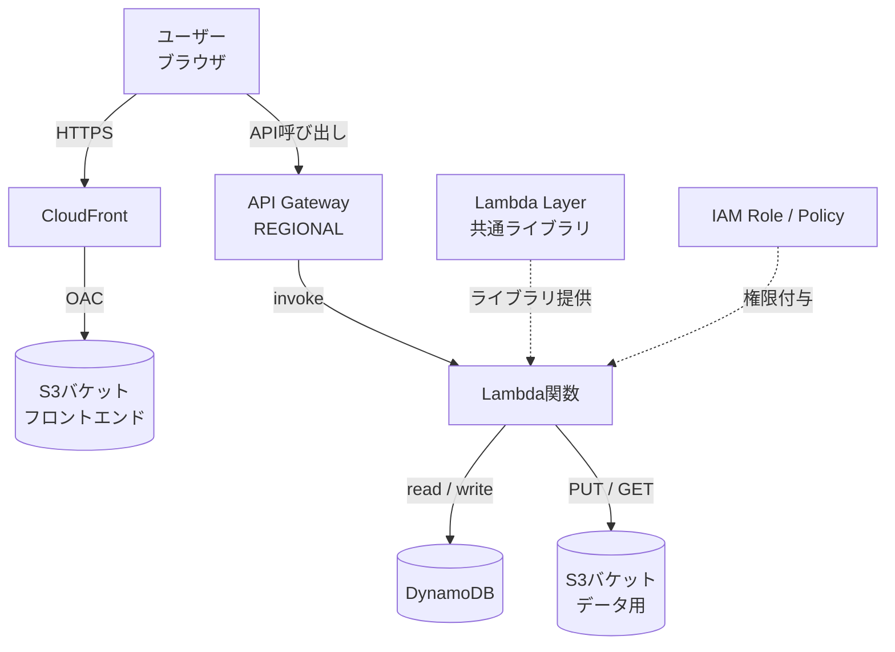
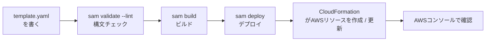

# AWS SAM Template（CloudFormation）入門ガイド

> **対象読者**：AWS初心者・SAM Template / CloudFormation 未経験者  
> **目的**：`template.yaml` と `samconfig.toml` の役割・書き方を1つ1つ丁寧に理解する

## 目次

- [このガイドの使い方（読む順番）](#このガイドの使い方読む順番)
  - [初めての方（まず動かしたい）](#初めての方まず動かしたい)
  - [リファレンスとして使いたい方](#リファレンスとして使いたい方)
- [まず動かしてみよう（5分で体験）](#まず動かしてみよう5分で体験)
  - [アーキテクチャ全体像（教材用サンプル）](#アーキテクチャ全体像教材用サンプル)
  - [SAM デプロイフロー](#sam-デプロイフロー)
  - [最小構成のサンプル（S3バケット1つ）](#最小構成のサンプルs3バケット1つ)
- [1. CloudFormation / SAM とは何か](#1-cloudformation--sam-とは何か)
  - [CloudFormation とは](#cloudformation-とは)
  - [SAM（Serverless Application Model）とは](#samserverless-application-modelとは)
  - [スタック（Stack）とは](#スタックstackとは)
- [2. 全体のファイル構成](#2-全体のファイル構成)
  - [この教材の命名規則](#この教材の命名規則)
- [3. template.yaml の全体構造](./SAM_テンプレート_リファレンス.md#3-templateyaml-の全体構造)
- [4. template.yaml 各セクション詳細](./SAM_テンプレート_リファレンス.md#4-templateyaml-各セクション詳細)
- [5. Resources 各リソースの詳細](./SAM_テンプレート_リファレンス.md#5-resources-各リソースの詳細)
  - [5.1 S3 バケット](./SAM_テンプレート_リファレンス.md#51-s3-バケット)
  - [5.2 IAM Role（ロール）](./SAM_テンプレート_リファレンス.md#52-iam-roleロール)
  - [5.3 IAM ManagedPolicy（ポリシー）](./SAM_テンプレート_リファレンス.md#53-iam-managedpolicyポリシー)
  - [5.4 API Gateway（Serverless::Api）](./SAM_テンプレート_リファレンス.md#54-api-gatewayserverlessapi)
  - [5.5 Lambda Layer（Serverless::LayerVersion）](./SAM_テンプレート_リファレンス.md#55-lambda-layerserverlesslayerversion)
  - [5.6 Lambda関数（Serverless::Function）](./SAM_テンプレート_リファレンス.md#56-lambda関数serverlessfunction)
  - [5.7 DynamoDB テーブル](./SAM_テンプレート_リファレンス.md#57-dynamodb-テーブル)
  - [5.8 Cognito](./SAM_テンプレート_リファレンス.md#58-cognito)
  - [5.9 CloudFront（S3 + CloudFront によるSPAホスティング）](./SAM_テンプレート_リファレンス.md#59-cloudfronts3--cloudfront-によるspaホスティング)
- [6. 組み込み関数（Sub、Ref、GetAtt など）](./SAM_テンプレート_リファレンス.md#6-組み込み関数subrefgetatt-など)
- [7. samconfig.toml の詳細](./SAM_コマンド_トラブルシューティング.md#7-samconfigtoml-の詳細)
- [8. SAM コマンドの詳細](./SAM_コマンド_トラブルシューティング.md#8-sam-コマンドの詳細)
- [9. よくある質問](./SAM_コマンド_トラブルシューティング.md#9-よくある質問)
- [10. よくあるエラーと対処法](./SAM_コマンド_トラブルシューティング.md#10-よくあるエラーと対処法)

---

## このガイドの使い方（読む順番）

> このガイドは「入門パート」と「リファレンスパート」の2層構成です。  
> **全部読む必要はありません。目的に合わせて読む順番を変えましょう。**

### 初めての方（まず動かしたい）

| ステップ | 章 | 内容 | 目安時間 |
| --- | --- | --- | --- |
| 1 | [まず動かしてみよう（5分で体験）](#まず動かしてみよう5分で体験) | 最小サンプルで実際にdeployしてみる | 5〜10分 |
| 2 | [1章](#1-cloudformation--sam-とは何か) | CloudFormation / SAMの概念を理解する | 10分 |
| 3 | [8章](./SAM_コマンド_トラブルシューティング.md#8-sam-コマンドの詳細) | `sam build` / `sam deploy` を理解する | 10分 |
| 4 | [7章](./SAM_コマンド_トラブルシューティング.md#7-samconfigtoml-の詳細) | `samconfig.toml` を理解する | 10分 |
| 5 | [4〜6章](./SAM_テンプレート_リファレンス.md#4-templateyaml-各セクション詳細) | `template.yaml` の各セクションを詳しく理解する | 30〜60分 |

### リファレンスとして使いたい方

目次から目的のセクションへ直接ジャンプしてください。

- [組み込み関数](./SAM_テンプレート_リファレンス.md#6-組み込み関数subrefgetatt-など) — 書き方を忘れたとき
- [SAM コマンドの詳細](./SAM_コマンド_トラブルシューティング.md#8-sam-コマンドの詳細) — deployオプションを確認したいとき
- [よくあるエラーと対処法](./SAM_コマンド_トラブルシューティング.md#10-よくあるエラーと対処法) — エラーが出たとき

## まず動かしてみよう（5分で体験）

> **まず動かしてから理解する**のが効率的です。  
> ここではS3バケット1つだけを作る「最小構成」でSAMの一連の流れを体験します。

### アーキテクチャ全体像（教材用サンプル）

この教材では、一般的なサーバーレスWebアプリケーションをイメージしたサンプル構成を使用します。



> この図はAWS SAMを学ぶための教材用サンプルです。実際のシステムでは要件に応じて、認証、ネットワーク、監視、WAFなどの構成を追加します。

### SAM デプロイフロー



### 最小構成のサンプル（S3バケット1つ）

#### template.yaml（最小版）

```yaml
AWSTemplateFormatVersion: '2010-09-09'
Transform: AWS::Serverless-2016-10-31

Description: >
  AWS SAM minimal sample

Parameters:
  ResourcePrefix:
    Type: String
    Default: as

  Environment:
    Type: String
    Default: dev
    AllowedValues:
      - dev
      - prd

  ProjectName:
    Type: String
    Default: sam-project

Resources:
  SampleBucket:
    Type: AWS::S3::Bucket
    Properties:
      # AWSアカウントIDを末尾に含め、一意になりやすい名前にする
      BucketName: !Sub ${ResourcePrefix}-${Environment}-${ProjectName}-sample-${AWS::AccountId}

      PublicAccessBlockConfiguration:
        BlockPublicAcls: true
        BlockPublicPolicy: true
        IgnorePublicAcls: true
        RestrictPublicBuckets: true

      Tags:
        - Key: Project
          Value: !Ref ProjectName
        - Key: Environment
          Value: !Ref Environment

Outputs:
  SampleBucketName:
    Value: !Ref SampleBucket
    Description: 作成されたS3バケット名
```

#### samconfig.toml（最小版）

```toml
version = 0.1

[dev]
[dev.deploy]
[dev.deploy.parameters]
stack_name = "as-dev-sam-project"
region = "ap-northeast-1"
parameter_overrides = "ParameterKey=ResourcePrefix,ParameterValue=as ParameterKey=Environment,ParameterValue=dev ParameterKey=ProjectName,ParameterValue=sam-project"
```

> この最小例ではIAMリソースを作成しないため、`capabilities` の指定は不要です。後述のサンプルでは名前付きIAMリソースを作成するため、`CAPABILITY_NAMED_IAM` を使用します。

#### コマンド実行

```bash
sam validate --lint
sam build
sam deploy --config-file samconfig.toml --config-env dev --resolve-s3
```

完了後は、AWSコンソールのCloudFormationとS3から作成されたリソースを確認できます。

> `--resolve-s3` はLambdaやLayerなどのデプロイ用アーティファクトをSAM CLIに管理させる場合に便利です。このS3バケットだけの最小構成では必須ではありません。

#### 後片付け（スタックを削除）

```bash
sam delete --stack-name as-dev-sam-project
```

---

## 1. CloudFormation / SAM とは何か

### CloudFormation とは

**AWS CloudFormation** は、AWSリソース（Lambda、API Gateway、S3、DynamoDBなど）をコードで定義して、まとめて作成・管理するサービスです。

```text
通常の手順（手動）：
  AWSコンソール → Lambda作成 → API Gateway作成 → S3作成 → DynamoDB作成 → ...

SAM / CloudFormationを使う場合：
  template.yaml を書く → sam deploy → CloudFormation経由でまとめて作成・更新
```

この「コードでインフラを定義する」考え方を **IaC（Infrastructure as Code）** と呼びます。

> **メリット**
> - 同じ設定を開発環境・本番環境で再現しやすい
> - 変更履歴をGitで管理できる
> - スタック単位でリソースを管理できる
> - チームで設定を共有・レビューできる

### SAM（Serverless Application Model）とは

**AWS SAM** はCloudFormationを拡張し、LambdaやAPI Gatewayなどのサーバーレスリソースをより簡潔に定義できる仕組みです。

S3やDynamoDBなど、通常のCloudFormationリソースも同じ `template.yaml` 内に記述できます。

```yaml
Transform: AWS::Serverless-2016-10-31
```

この記述によってSAMの変換が有効になります。

### スタック（Stack）とは

CloudFormationでは、`template.yaml` から作られるリソースの集合を**スタック**と呼びます。

```text
例：as-dev-sam-project というスタック
    ├─ S3バケット
    ├─ DynamoDBテーブル
    ├─ Lambda関数
    ├─ API Gateway
    └─ IAMロール・ポリシー
```

## 2. 全体のファイル構成

この教材では、例として次のような構成を使用します。

```text
sam-project/
├─ template.yaml
├─ samconfig.toml
├─ src/
│   ├─ api/
│   │   └─ app.py
│   └─ scheduled/
│       └─ app.py
├─ layers/
│   └─ common/
│       └─ requirements.txt
└─ events/
    └─ api-event.json
```

- `template.yaml`：AWSリソースの設計図
- `samconfig.toml`：SAM CLIのデプロイ設定
- `src/`：Lambda関数のコード
- `layers/`：Lambda Layerとして共有するライブラリ
- `events/`：ローカルテスト用イベント

### この教材の命名規則

教材内では、例を読みやすくするため次のルールで統一します。

```text
■ AWS上の物理リソース名
lowercase kebab-case

as-dev-sam-project
as-dev-sam-project-lambda-role
as-dev-sam-project-api

■ CloudFormation / SAM 論理ID
PascalCase

SamProjectDataBucket
SamProjectFunctionsRole
SamProjectFunctionsPolicy
SamProjectFunctions
SamProjectApi

■ Parameters
PascalCase

ResourcePrefix
Environment
ProjectName

■ Lambda環境変数
UPPER_SNAKE_CASE

BUCKET_NAME
TABLE_NAME
LOG_LEVEL
POWERTOOLS_SERVICE_NAME
```

物理リソース名の基本形は次のようにします。

```text
${ResourcePrefix}-${Environment}-${ProjectName}-${用途}
```

S3バケット名のようにAWS側で広い範囲の一意性が必要なリソースでは、教材内ではAWSアカウントIDを末尾に付け、一意になりやすくします。

```text
${ResourcePrefix}-${Environment}-${ProjectName}-${用途}-${AWS::AccountId}

# 例
as-dev-sam-project-data-123456789012
```

`ResourcePrefix` は教材用の接頭辞です。この教材では `as` をデフォルト値としていますが、実際のプロジェクトでは組織やチームの命名ルールに合わせて変更します。

---

> **関連ドキュメント**：[テンプレートリファレンス（3～6章）→](./SAM_テンプレート_リファレンス.md) | [コマンド・トラブルシューティング（7～10章）→](./SAM_コマンド_トラブルシューティング.md)
